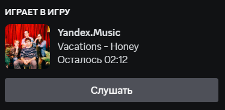

# **WinSdk + Yandex Music Discord Rich Presence**
Discord RPC для показа музыки которую вы сейчас слушаете на компьютере. Загрузка треков и их обложка происходит из Яндекс Музыки.

Есть похожие RPC которые показывают текущий трек используя Api Яндекс Музыки. Но они не могут показывать что играет из радио(например `Моя Волна`).
Поэтому я создал скрипт который берет из `winsdk.windows.media.control` информацию о текущем треке, делает поиск в яндекс музыке и выводит трек в Discord.

Плюсы по сравнению с другими скриптами:    
Не нужен токен Яндекс Музыки ✅  
Показывает треки из подборок, радио ✅  
Не ограничен использованием Яндекс Музыки, музыку можно слушать хоть из ВКонтакте ✅  
Работает как с браузерами так и с приложениями ✅   
Показывает статус паузы ✅  
Показывает сколько осталось до конца трека ✅

За основу был взят код: https://github.com/schwarzalexey/yandex-music-rpc/tree/main  
Используется Yandex Music API: https://github.com/MarshalX/yandex-music-api

------------
В случае если вы слушаете музыку не только из яндекс музыки то рекомендую поставить в main.py `strong_find = False` вместо True. Тогда будет показыватся лучший результат по поиску, но не всегда точный.

## Требования
Работа проверена только на Windows 11 и Windows 10, на других версиях и платформах работать не будет.

Если вы не будете использовать ехе файл то:
1. Python 3.10+

## Как использовать Exe?
1. Скачиваем файлы с репозитория
  
2. Открываем папку bin и запускаем main.exe

## Как использовать main.py?

1. Открываем терминал и идем в папку где находится файл `requirements.txt`. Пишем `pip install -r requirements.txt`, для того что бы установить зависимости.

2. В терминал пишем `python main.py`

## Баги
На данный момент багов не замечено, но бывают случаи когда музыку не получается найти по вине Яндекс Муызки. Такое бывает но редко.

## TODO
Сдлать так что бы скрипт находилася в трее  
Улучшить поиск песен

>Код не идеален, т.к питон не мой постоянный язык и писалася скрипт только для личного пользования, но он может стать основой для ваших скриптов.
